<p align="center">
  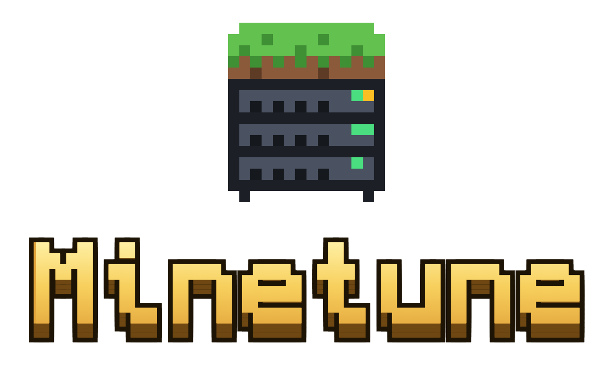
</p>

<p align="center">
  <strong>Servidor Minecraft pronto para produção em Docker, com painel web próprio.</strong>
</p>

<p align="center">
  
  
  
  
  
</p>

<p align="center">
  <a href="#-início-rápido">Início rápido</a> ·
  <a href="#-o-painel">Painel</a> ·
  <a href="#-backups">Backups</a> ·
  <a href="#-deploy-e-acesso-pela-internet">Deploy</a> ·
  <a href="#-documentação">Documentação</a> ·
  <a href="https://juniorcarlini.github.io/minetune/changelog.html">Changelog</a> ·
  <a href="https://juniorcarlini.github.io/minetune/">Site</a>
</p>

<p align="center">
  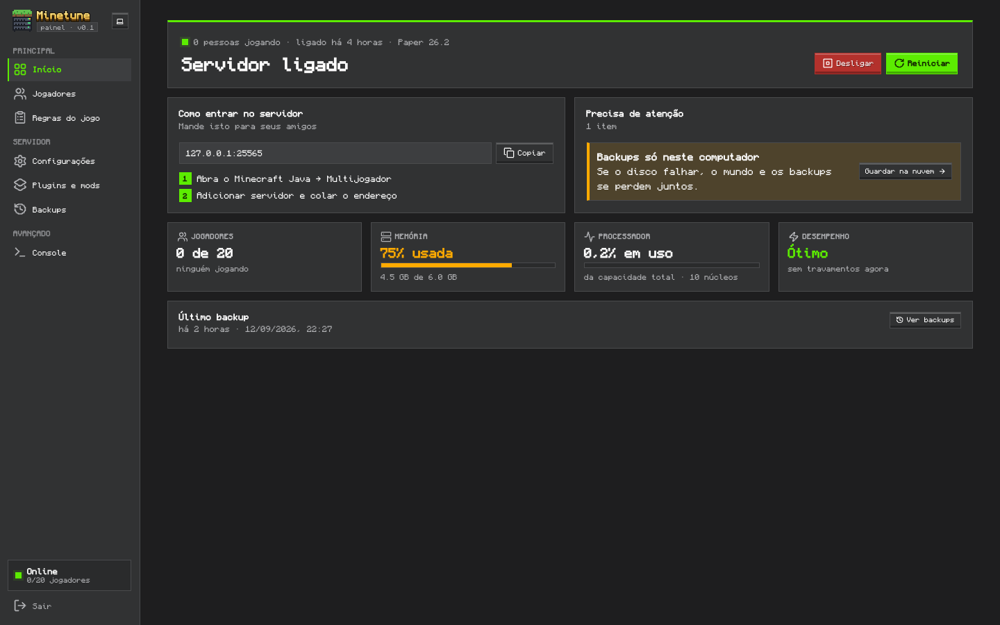
</p>

---

## Sobre

O **Minetune** é a forma mais simples de **criar e administrar um servidor de
Minecraft** (Java e Bedrock) com Docker: um painel web em português, feito para
quem nunca administrou um servidor, com backups automáticos e caminhos prontos
para colocar no ar em casa, numa VPS ou no EasyPanel.
Site oficial: **<https://juniorcarlini.github.io/minetune/>**.

Ele junta tudo o que um servidor Minecraft precisa para rodar de verdade, sem improviso:

- **Servidor otimizado** sobre a imagem [`itzg/minecraft-server`](https://github.com/itzg/docker-minecraft-server):
  Paper, Purpur, Fabric, NeoForge ou Vanilla, com Java 25 e flags de GC ajustadas.
- **Painel web próprio** para configurar o jogo sem editar arquivos: propriedades,
  regras de jogo, jogadores, plugins/mods, backups e console.
- **Backups incrementais e criptografados** com restic, para disco local, AWS S3,
  Cloudflare R2 ou um S3 próprio com RustFS.
- **Configuração como código**: tudo em arquivos versionáveis, o painel só edita esses arquivos.
- **Caminhos documentados** para rodar em casa, numa VPS ou no EasyPanel, e para
  abrir o servidor para a internet (inclusive atrás de CGNAT).

## Sumário

- [Início rápido](#-início-rápido)
- [O que vem pronto](#-o-que-vem-pronto)
- [O painel](#-o-painel)
- [Configuração](#-configuração)
- [Backups](#-backups)
- [Deploy e acesso pela internet](#-deploy-e-acesso-pela-internet)
- [Crossplay com Bedrock](#-crossplay-com-bedrock)
- [Segurança](#-segurança)
- [Operação do dia a dia](#-operação-do-dia-a-dia)
- [Arquitetura](#-arquitetura)
- [Estrutura do projeto](#-estrutura-do-projeto)
- [Desenvolvimento do painel](#-desenvolvimento-do-painel)
- [Documentação](#-documentação)
- [Roadmap](#-roadmap)
- [Créditos](#-créditos)

## 🚀 Início rápido

**Requisitos:** Docker com Compose v2, `make` e `openssl`. Para o servidor, reserve
pelo menos 6 GB de RAM (4 GB de heap + folga da JVM).

```bash
git clone https://github.com/JuniorCarlini/minetune.git
cd minetune

make init   # cria o .env com senhas aleatórias
make up     # sobe tudo; o primeiro boot baixa o servidor e gera o mundo (~1–3 min)
```

> [!IMPORTANT]
> O `make init` gera a `RESTIC_PASSWORD`, que criptografa os backups.
> **Guarde essa senha fora do servidor**: sem ela não há como restaurar nada.

Pronto:

| | Endereço | Acesso |
|---|---|---|
| **Painel** | <http://localhost:8080> | senha em `PANEL_PASSWORD` no `.env` |
| **Jogo (Java)** | `localhost:25565` | |
| **Jogo (Bedrock)** | `localhost:19132` (UDP) | só com o crossplay ligado |

## 📦 O que vem pronto

| | |
|---|---|
| **Servidor** | Paper 26.2 por padrão; Purpur, Fabric, NeoForge ou Vanilla com um clique. Java 25, flags de GC Aikar e memória limitada por container. |
| **Painel** | Feito para quem não é técnico: tela Início com o estado do servidor, endereço para copiar e avisos com o botão que resolve; jogadores, lista de convidados e administradores; configurações em linguagem simples com versões oficiais de cada software; **todas as regras de jogo** da versão em execução; plugins e mods do Modrinth; backups com destino configurável; console. |
| **Backups** | restic incremental, deduplicado e criptografado. Agendado, manual e automático antes de restore e updates. Retenção configurável. |
| **Crossplay** | Geyser + Floodgate com um toggle: jogadores Bedrock entram sem conta Java. Desligado por padrão. |
| **Otimização** | Distâncias de visão e simulação ajustadas, patches do Paper (explosões, redstone Alternate Current, limites de entidades) e Chunky para pré-gerar o mundo. |
| **Segurança** | Painel preso ao localhost por padrão, sessão HMAC com limite de tentativas, RCON nunca exposto e Docker acessado por um proxy que **não permite criar containers**. |
| **Exposição** | Port forward, túnel playit.gg (resolve CGNAT), VPS como ponte ou EasyPanel. |

## 🖥️ O painel

Pensado para quem nunca administrou um servidor: toda tela segue o mesmo padrão
(título com uma frase, ações à direita, avisos com o botão que resolve) e usa
palavras do jogo, como administradores e lista de convidados. Termos técnicos
ficam atrás de "Opções avançadas". O visual é em blocos, com cara de Minecraft:
cantos retos, botões com bisel, fonte e ícones pixelados. Tema claro, escuro ou
seguindo o sistema, e três versões de logo para escolher (clique no logo do menu).

<table>
  <tr>
    <td width="50%">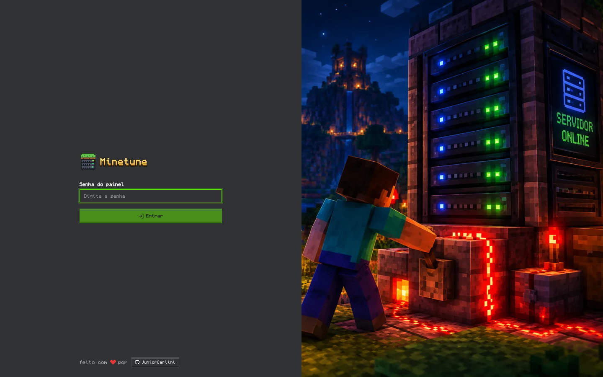<p align="center"><sub>Login</sub></p></td>
    <td width="50%">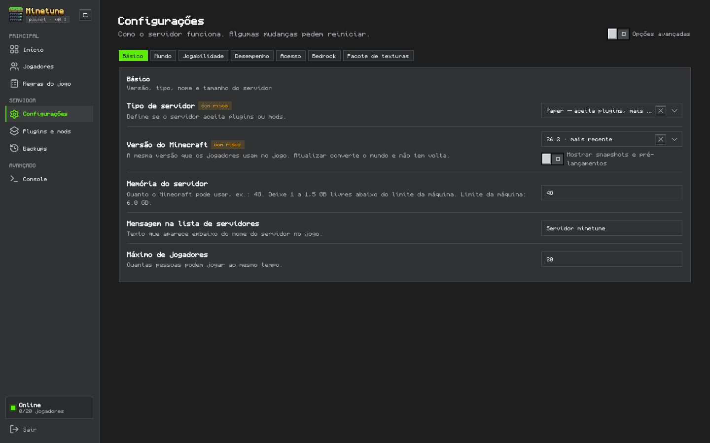<p align="center"><sub>Configurações do servidor</sub></p></td>
  </tr>
  <tr>
    <td>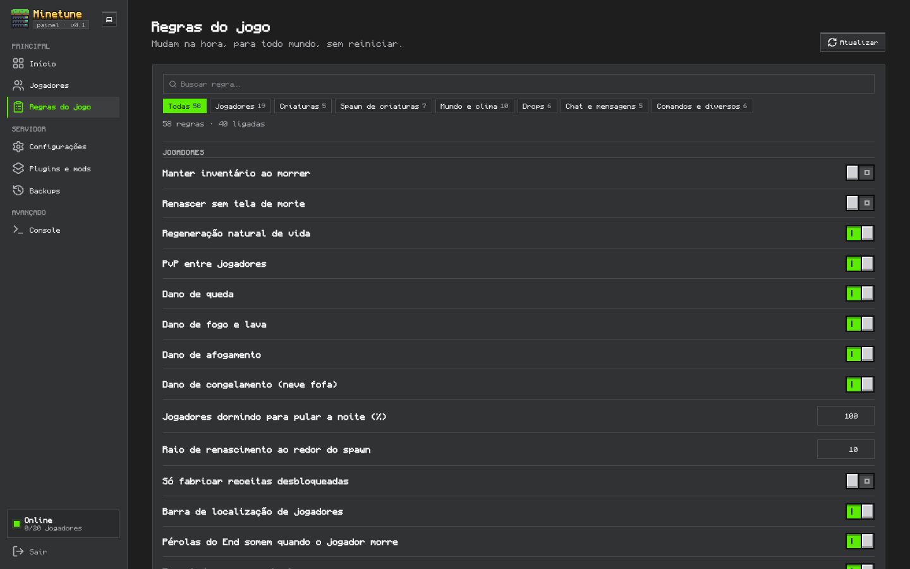<p align="center"><sub>Regras do jogo</sub></p></td>
    <td>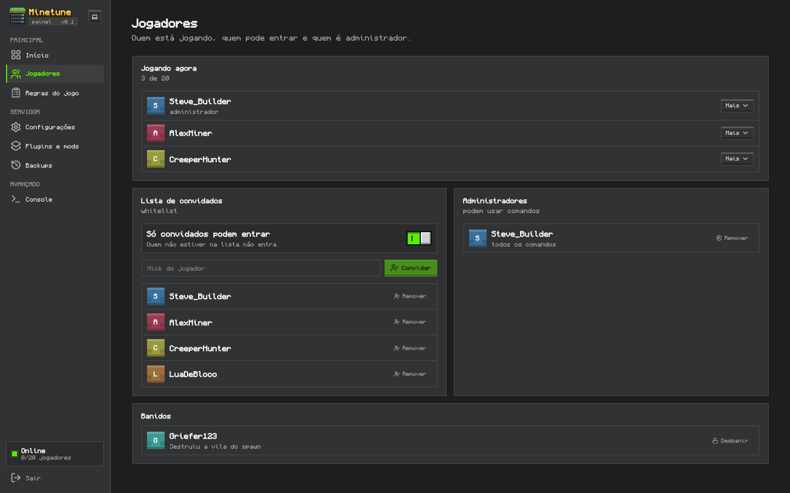<p align="center"><sub>Jogadores</sub></p></td>
  </tr>
  <tr>
    <td>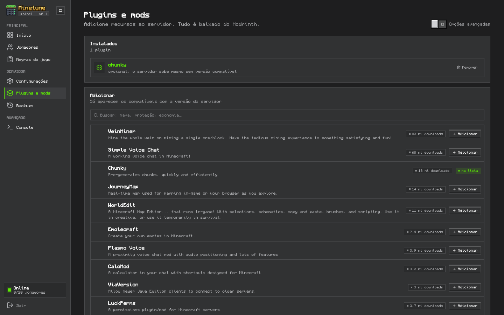<p align="center"><sub>Plugins e mods (Modrinth)</sub></p></td>
    <td>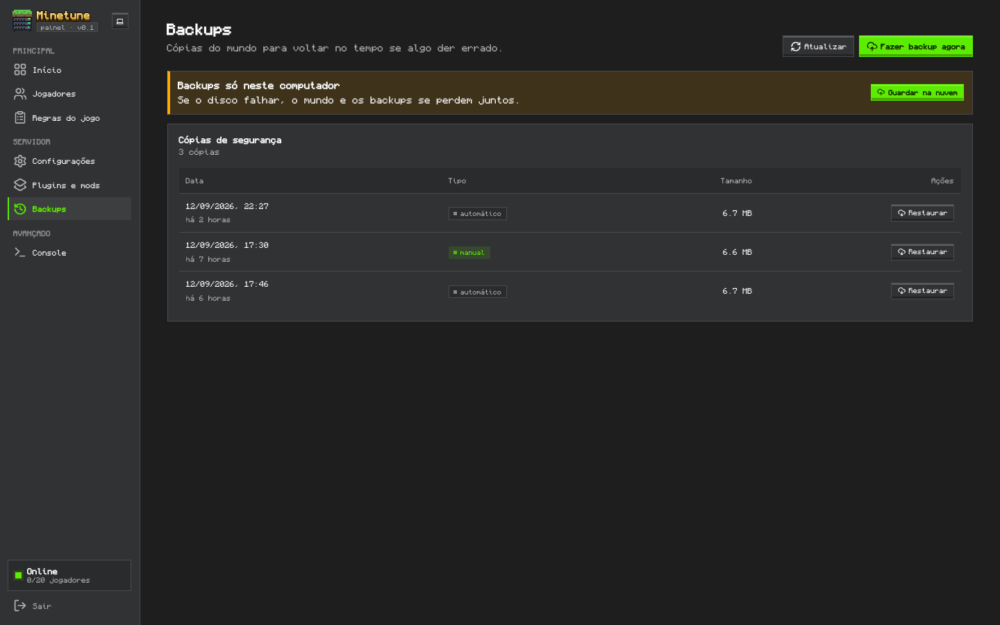<p align="center"><sub>Backups e restauração</sub></p></td>
  </tr>
  <tr>
    <td>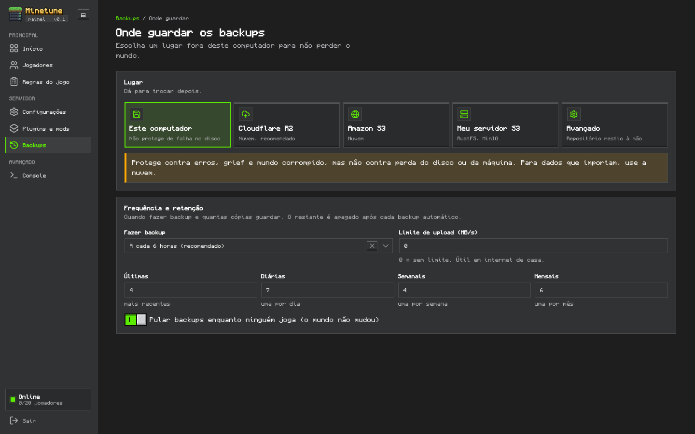<p align="center"><sub>Onde guardar os backups</sub></p></td>
    <td>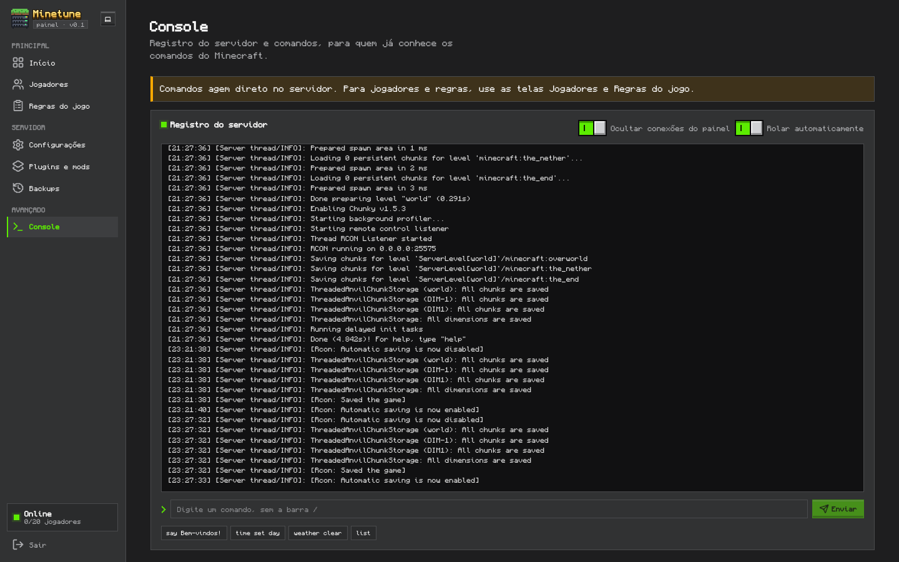<p align="center"><sub>Console (avançado)</sub></p></td>
  </tr>
</table>

| Página | O que dá para fazer |
|---|---|
| **Início** | Ver se o servidor está ligado, ligar, desligar e reiniciar; copiar o endereço para os amigos; jogadores, memória, processador e desempenho em frases simples; "Precisa de atenção" com o botão que resolve cada aviso; último backup. |
| **Jogadores** | Quem está jogando; tornar administrador, expulsar e banir pelo menu "Mais"; lista de convidados com a chave "Só convidados podem entrar"; desbanir. |
| **Regras do jogo** | Todas as regras que a versão em execução oferece, com busca e categorias, aplicadas na hora em todas as dimensões. |
| **Configurações** | Tipo e versão do servidor (lista oficial de cada software), memória, mensagem na lista de servidores, mundo, dificuldade, distâncias, acesso e Bedrock. Tudo validado antes de salvar; opções técnicas só com "Opções avançadas". |
| **Plugins e mods** | Buscar no Modrinth só o que é compatível e adicionar ou remover; a lista é separada por loader (Paper, Fabric, NeoForge). |
| **Backups** | Saber no topo se o mundo está protegido; backup na hora; lista de cópias e restauração segura (faz um backup antes e desfaz se algo falhar). |
| **Onde guardar** | Destino dos backups (este computador, Cloudflare R2, Amazon S3 ou S3 próprio) com teste de conexão, frequência e retenção. |
| **Console** | No grupo Avançado: registro ao vivo do servidor e comandos, com sugestões. |

No celular, o painel continua usável: o login mostra só o formulário e o menu vira
uma barra de ícones no topo.

## ⚙️ Configuração

São **dois arquivos, de propósito**, porque mudam em ritmos diferentes:

| Arquivo | O que guarda | Como aplicar |
|---|---|---|
| `.env` | **Infraestrutura e segredos**: portas, limites de recursos, senhas, destino e agenda dos backups. | `make up` |
| `config/server.env` | **Jogo**: tipo, versão, memória da JVM, MOTD, mundo, dificuldade, distâncias, whitelist, crossplay. É o arquivo que o painel edita. | Reiniciar o servidor (`make restart` ou botão no painel) |

Plugins e mods ficam em `config/modrinth/<loader>.txt`, e ajustes nos YAMLs do
Paper e do Geyser em `config/patches/`.

Principais variáveis do `.env`:

| Variável | Padrão | Para quê |
|---|---|---|
| `PANEL_BIND` / `PANEL_PORT` | `127.0.0.1` / `8080` | Onde o painel escuta. Só troque para `0.0.0.0` com HTTPS na frente. |
| `MC_PORT` / `BEDROCK_PORT` | `25565` / `19132` | Portas do jogo. |
| `MC_MEMORY_LIMIT` | `6g` | Limite de RAM do container. A heap (`MEMORY`) deve ficar 1–1,5 GB abaixo. |
| `MC_IMAGE_TAG` | `java25` | Java da imagem. Versões antigas do jogo: `java21`, `java17`, `java8`. |
| `RESTIC_REPOSITORY` | `/backups/restic` | Destino dos backups (local, S3, R2 ou RustFS). |
| `BACKUP_INTERVAL` | `6h` | Frequência dos backups automáticos. |
| `BACKUP_RETENTION` | 4 últimos, 7 diários, 4 semanais, 6 mensais | Quantas cópias manter. |
| `COMPOSE_FILE` | `compose.yaml` | Ativa os overlays de RustFS e playit.gg. |

A lista completa, com comentários, está no [`.env.example`](.env.example).

## 💾 Backups

Os backups usam [restic](https://restic.net/): cada snapshot só envia o que mudou,
tudo é deduplicado e criptografado antes de sair da máquina. O serviço de backup
pausa o salvamento do mundo durante a cópia (`save-off` / `save-all`), então o
snapshot nunca pega um arquivo pela metade.

| Destino | `RESTIC_REPOSITORY` |
|---|---|
| Disco local (padrão) | `/backups/restic` |
| Cloudflare R2 | `s3:https://<ACCOUNT_ID>.r2.cloudflarestorage.com/<bucket>` |
| AWS S3 | `s3:s3.<region>.amazonaws.com/<bucket>` |
| RustFS na mesma máquina | `s3:http://rustfs:9000/minetune-backups` (com `compose.s3-local.yaml`) |
| RustFS em outra máquina | `s3:http://<ip>:9000/minetune-backups` |

> [!WARNING]
> O destino local **não protege contra perda do disco**. Para dados que importam,
> mande os backups para fora da máquina (R2, S3 ou RustFS em outro lugar).

Quando rodam:

- **Agendados**, a cada `BACKUP_INTERVAL`, pulando os horários em que o servidor está vazio.
- **Manuais**, pelo painel ou com `make backup`.
- **Automáticos** antes de um restore e antes de `make update`.

Restaurar: pelo painel (página Backups) ou `make restore SNAPSHOT=latest`. O restore
guarda o mundo atual antes e desfaz a troca se algo der errado.

Destinos, regra 3-2-1, restore de um arquivo só e recuperação numa máquina nova:
[docs/BACKUP.md](docs/BACKUP.md).

## 🌐 Deploy e acesso pela internet

| Onde rodar | Resumo |
|---|---|
| **PC ou servidor de casa** | `make init && make up`. |
| **VPS** (Hetzner, Oracle, Contabo, AWS…) | Mesmo fluxo; painel atrás de um proxy reverso com HTTPS. |
| **EasyPanel** | Importar o compose e publicar o painel pelo domínio do EasyPanel. |

Como os jogadores chegam até o servidor:

| Opção | Quando usar |
|---|---|
| **Port forward** | Você tem IP público em casa. |
| **Túnel playit.gg** | Sem IP público ou atrás de CGNAT; não precisa abrir portas. Ative `compose.tunnel.yaml`. |
| **VPS como ponte** | Quer IP fixo e boa latência, mas com o servidor rodando em casa. |
| **Hospedar na VPS** | Tudo na nuvem. |

Passo a passo, domínio próprio e checklist de segurança: [docs/DEPLOY.md](docs/DEPLOY.md).

## 🤝 Crossplay com Bedrock

Ligue **Crossplay** em Configurações (ou `BEDROCK_CROSSPLAY="true"` em
`config/server.env`) e reinicie. O Minetune instala Geyser e Floodgate, e jogadores
de celular, console e Windows (Bedrock) entram pela porta `19132/UDP` sem precisar
de conta Java.

## 🔒 Segurança

- O painel escuta só em `127.0.0.1` por padrão. Para acesso remoto, coloque um proxy
  reverso com HTTPS na frente.
- Sessão assinada com HMAC, limite de tentativas de login e proteção contra
  requisições forjadas nas ações.
- O RCON fica só na rede interna do compose e nunca é publicado.
- O painel não fala direto com o `docker.sock`: passa por um proxy com lista de
  permissões que só deixa **ler status e logs e ligar, parar ou reiniciar**
  containers. Criar containers ou executar comandos neles é bloqueado.
- Todos os segredos ficam no `.env`, criado com permissão `600`.

## 🛠️ Operação do dia a dia

```bash
make help                     # todos os comandos
make up                       # sobe a stack (aplica mudanças do .env)
make down                     # para e remove os containers (dados preservados)
make restart                  # reinicia o servidor (aplica config/server.env)
make ps                       # estado dos serviços
make logs                     # logs do servidor (SERVICE=backup|panel)
make console                  # console RCON interativo
make backup                   # backup imediato
make snapshots                # lista os backups
make restore SNAPSHOT=latest  # restaura (faz backup de segurança antes)
make update                   # backup + atualiza imagens + recria a stack
make check                    # valida compose, typecheck, testes e build do painel
```

Dicas de desempenho (pré-gerar o mundo, distâncias, memória, diagnóstico de lag com
spark): [docs/PERFORMANCE.md](docs/PERFORMANCE.md).

## 🧱 Arquitetura

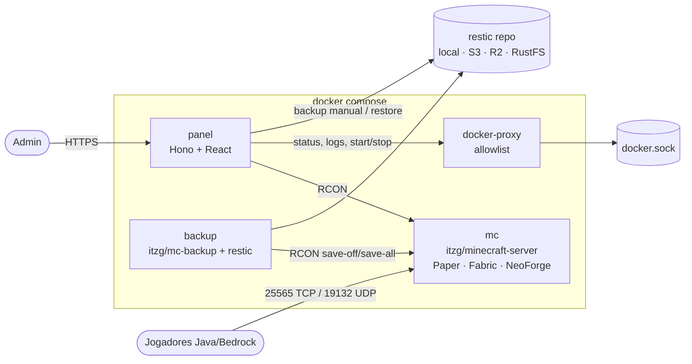

| Serviço | Imagem | Papel |
|---|---|---|
| `mc` | `itzg/minecraft-server` | O servidor. Lê `config/server.env` a cada start. |
| `backup` | `itzg/mc-backup` | Backups agendados com restic, coordenados via RCON. |
| `panel` | construída de `panel/` | API (Hono) e interface (React). |
| `docker-proxy` | `wollomatic/socket-proxy` | Único acesso ao Docker, com lista de permissões. |

Por que cada decisão foi tomada: [docs/ARCHITECTURE.md](docs/ARCHITECTURE.md).

## 📁 Estrutura do projeto

```
.
├── compose.yaml              # stack: mc, backup, panel, docker-proxy
├── compose.s3-local.yaml     # overlay: RustFS como destino S3 dos backups
├── compose.tunnel.yaml       # overlay: túnel playit.gg
├── .env.example              # infraestrutura: portas, recursos, segredos, backup
├── Makefile                  # operação do dia a dia (make help)
├── config/                   # configuração do JOGO (versionável, editada pelo painel)
│   ├── server.env            #   tipo, versão, memória, propriedades do servidor
│   ├── modrinth/<loader>.txt #   plugins e mods por loader
│   └── patches/              #   ajustes em YAMLs do Paper e do Geyser
├── docker/minecraft/
│   └── entrypoint.sh         # carrega server.env a cada start, monta plugins e patches
├── panel/                    # painel web (TypeScript)
│   ├── src/shared/           #   catálogos e contratos usados pela API e pela UI
│   ├── src/server/           #   API Hono, RCON, Docker, restic, jobs, CLI
│   ├── src/web/              #   React + Vite com os componentes Tucano
│   └── scripts/              #   geração dos ícones pixelados
├── scripts/init.sh           # gera o .env com segredos aleatórios
└── docs/
    ├── ARCHITECTURE.md       # decisões e porquês
    ├── BACKUP.md             # destinos, restore, recuperação de desastre
    ├── DEPLOY.md             # local, VPS, EasyPanel, acesso pela internet
    ├── PERFORMANCE.md        # dimensionamento e tuning
    └── assets/               # logos e capturas de tela
```

## 👩‍💻 Desenvolvimento do painel

| Camada | Tecnologia |
|---|---|
| Backend | Node 24 rodando TypeScript direto (sem etapa de build), Hono e zod |
| Frontend | React 19, Vite 8 e TypeScript 7 |
| Interface | [Tucano](https://github.com/JuniorCarlini/tucano), fonte Monocraft e ícones RuneIcons |

```bash
cd panel
npm install
cp ../.env .env.local   # ajuste RCON_HOST e DOCKER_API para rodar fora do compose
npm run dev             # API em :8080 + Vite em :5173 com hot reload
npm run check           # typecheck + testes + build
```

Os ícones pixelados vêm da RuneIcons, travados num commit. Para gerar de novo:

```bash
node scripts/generate-rune-icons.mjs [commit]
```

## 📚 Documentação

| Documento | Conteúdo |
|---|---|
| [Arquitetura e decisões](docs/ARCHITECTURE.md) | Por que cada peça foi escolhida e o que ficou de fora. |
| [Backups e recuperação](docs/BACKUP.md) | Destinos, retenção, restore e recuperação numa máquina nova. |
| [Deploy e acesso pela internet](docs/DEPLOY.md) | Local, VPS, EasyPanel, túnel e domínio próprio. |
| [Desempenho](docs/PERFORMANCE.md) | Pré-geração do mundo, memória, distâncias e diagnóstico de lag. |
| [Changelog](CHANGELOG.md) | O que mudou em cada versão. |

## 🗺️ Roadmap

- [ ] Vários servidores e proxy Velocity na mesma stack
- [ ] Usuários e papéis no painel, com log de auditoria
- [ ] Métricas Prometheus + Grafana
- [ ] Upload de mundos e datapacks pelo painel
- [ ] Notificações no Discord (backup com falha, servidor fora do ar)

## 🙏 Créditos

- [itzg/docker-minecraft-server](https://github.com/itzg/docker-minecraft-server) e
  [itzg/docker-mc-backup](https://github.com/itzg/docker-mc-backup): imagens do servidor e dos backups.
- [restic](https://restic.net/): backups.
- [Geyser](https://geysermc.org/) e Floodgate: crossplay com Bedrock.
- [Tucano](https://github.com/JuniorCarlini/tucano): componentes e tokens da interface.
- [Monocraft](https://github.com/IdreesInc/Monocraft) (OFL-1.1): fonte pixelada.
- [RuneIcons](https://github.com/Nexvyn/runeicons) (Apache-2.0): ícones pixelados.

Minecraft é marca da Mojang Studios e da Microsoft. O Minetune não é um produto
oficial nem é afiliado à Mojang ou à Microsoft.

---

<p align="center">
  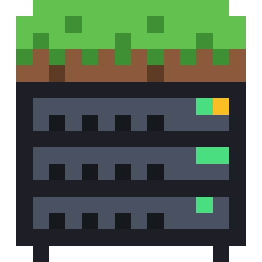
  <br>
  Feito com ❤ por <a href="https://github.com/JuniorCarlini">JuniorCarlini</a>
</p>
